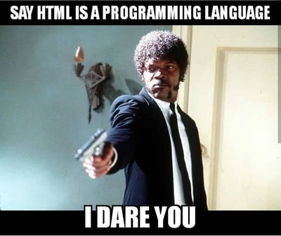

# Web Development 1- HTML/CSS

A repository to store all the course content files for **'Web Development 1 HTML/CSS'**. It includes files like class notes, assignments, labs, etc. for the course.

---

## Instructor

- Joanna Kommala 

---

## What We Learn

This class is about learning HTML and CSS to be able to create the structure for a webpage as well as to beautify it. We write the HTML codes and then link the CSS file to the created page.[^1]



_A programming meme for HTML/CSS"_

> :memo: **Note:** This class is one of those important classes that many may find simple but is actually hard.

[^note]: This class takes place in the LB 126 room every Wednesday from 3:20 AM - 6:00 PM.

---

## Learning Resource
- [W3School HTML](https://www.w3schools.com/html/)
- [W3School CSS](https://www.w3schools.com/css/)

---

## Code Sample - HTML

```html
<!DOCTYPE html>
<html>
<head>
<title>Page Title</title>
</head>
<body>

<h1>This is a Heading</h1>
<p>This is a paragraph.</p>

</body>
</html>
```

## Code Sample - CSS

```css
body {
  background-color: lightblue;
}

h1 {
  color: white;
  text-align: center;
}

p {
  font-family: verdana;
  font-size: 20px;
}
```

- HTML concepts
- DOM
- CSS concepts
- Flexbox
- Forms

[^1]: We have learned the above topics by now:
